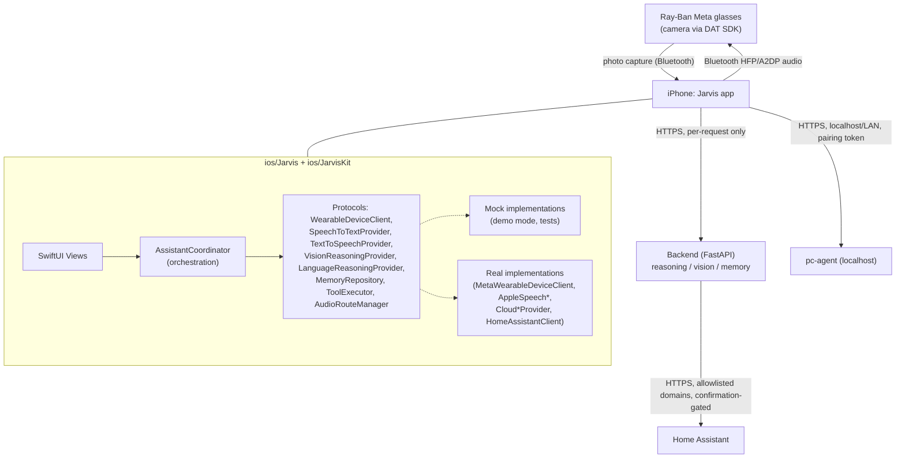
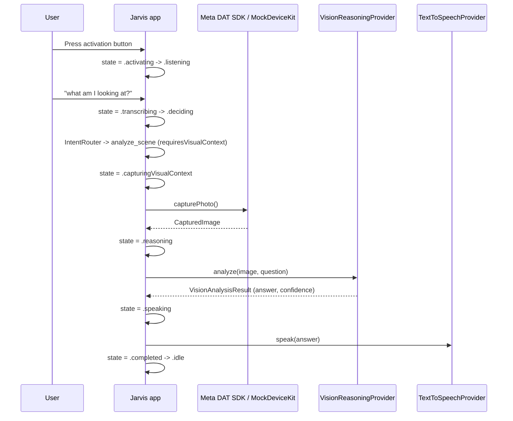
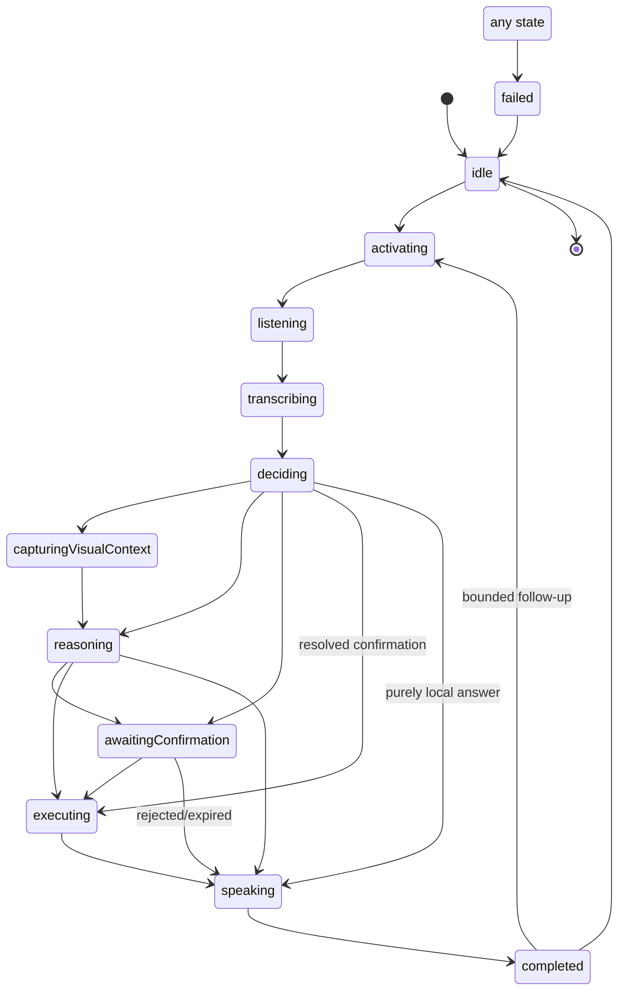
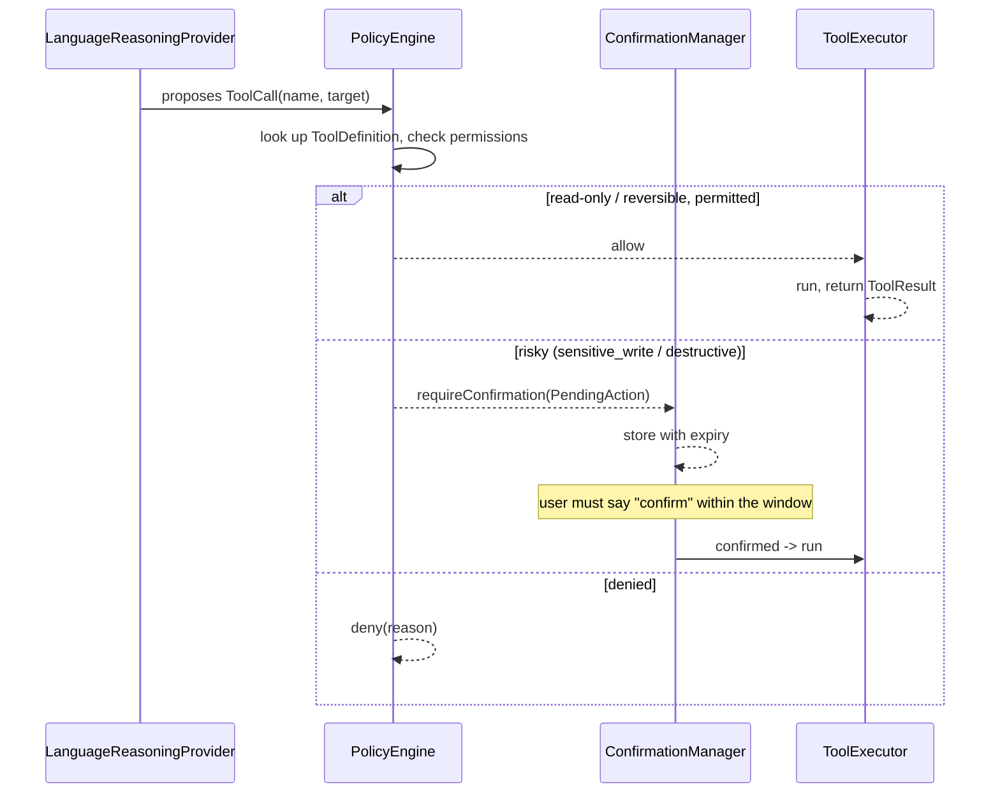
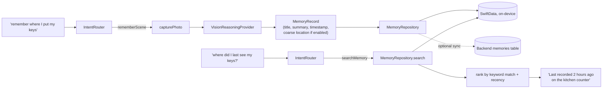
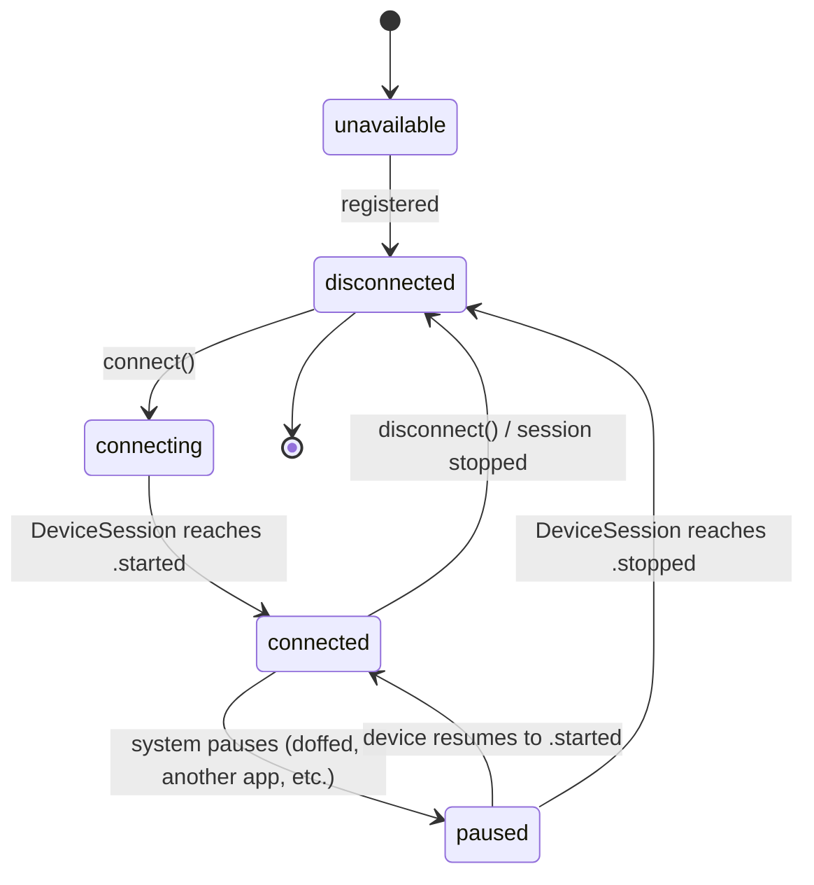

# Architecture

## System architecture



Every hardware/network/AI dependency is a protocol (`ios/JarvisKit/Sources/JarvisKit/Core/Protocols/`).
`AssistantCoordinator` only knows about protocols, never concrete SDK types — see
`ios/JarvisKit/Sources/JarvisKit/Services/AssistantCoordinator.swift`.

## Request sequence — "what am I looking at?"



## Assistant state machine



See `ios/JarvisKit/Sources/JarvisKit/Core/AssistantState.swift` for the exact transition
table and `ios/JarvisKit/Tests/JarvisKitTests/AssistantStateMachineTests.swift` for the
tests that enforce it (no overlapping listening sessions, no executing without going
through reasoning/confirmation, etc.).

## Tool authorization



The model never authorizes its own tool calls — `PolicyEngine`
(`ios/JarvisKit/Sources/JarvisKit/Services/PolicyEngine.swift` and its backend twin
`backend/app/tools/policy.py`) is the only place a call is allowed, denied, or sent to
confirmation. The backend re-runs policy at `/v1/tools/execute` time too, independent of
whatever the client believes `/v1/tools/propose` already said.

## Memory flow



Nothing here claims an object is *currently* at a location — every search result carries
its original timestamp, and `AssistantCoordinator.summarize(searchResults:)` always
phrases it as "last recorded," never "is."

## Meta device lifecycle



Backed by the real DAT SDK's `DeviceSession` states (`idle/starting/started/paused/stopping/stopped`,
see `docs/META_SDK_NOTES.md`) via `MetaWearableDeviceClient`, or by `MockWearableDeviceClient`
in demo mode. The app never tries to restart work while `.paused` — it waits for `.started`
or `.stopped`, per the SDK's own documented lifecycle rules.

## Layering

```
SwiftUI views (ios/Jarvis/Jarvis/Features/)
    -> AssistantCoordinator (application service)
    -> Protocols (Core/Protocols)
    -> Mocks (demo/tests) or real Integrations (Meta SDK, AVFoundation, URLSession, Home Assistant)
```

```
FastAPI routes (backend/app/api/)
    -> auth + rate limiting
    -> intent/orchestration (reasoning, vision services)
    -> PolicyEngine (backend/app/tools/policy.py)
    -> memory repository (SQLAlchemy)
```

No SDK, networking, or persistence logic lives directly in a SwiftUI `View` or a FastAPI
route function beyond simple parameter validation and calling into the layer below.
